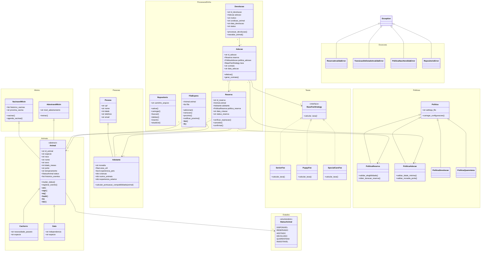

```mermaid
classDiagram
    namespace Estados {
        class StatusAnimal {
            <<enumeration>>
            DISPONIVEL
            RESERVADO
            ADOTADO
            DEVOLVIDO
            QUARENTENA
            INADOTAVEL
        }
    }

    namespace Mixins {
        class VacinavelMixin {
            +list historico_vacinas
            +str proxima_vacina
            +vacinar()
            +agenda_vacinas()
        }
        class AdestravelMixin {
            +str nivel_adestramento
            +treinar()
        }
    }

    namespace Animais {
        class Animal {
            <<abstract>>
            +str id_animal
            +str especie
            +str raca
            +str nome
            +str sexo
            +int idade_meses
            +str porte
            +str temperamento
            +StatusAnimal status
            +list historico_eventos
            +mudar_status()
            +registrar_evento()
            +__str__()
            +__repr__()
            +__eq__()
            +__hash__()
            +__lt__()
            +__iter__()
        }

        class Cachorro {
            +str necessidade_passeio
            +str especie
        }

        class Gato {
            +str independencia
            +str especie
        }
    }

    namespace Pessoas {
        class Pessoa {
            +str cpf
            +str nome
            +int idade
            +str telefone
            +str email
        }

        class Adotante {
            +str moradia
            +float area_util
            +bool experiencia_pets
            +dict criancas
            +dict outros_animais
            +dict experiencia_anterior
            +calcular_pontuacao_compatibilidade(animal)
        }
    }

    namespace Taxas {
        class BaseFeeStrategy {
            <<interface>>
            +calcular_taxa()*
        }
        class SeniorFee {
            +calcular_taxa()
        }
        class PuppyFee {
            +calcular_taxa()
        }
        class SpecialCareFee {
            +calcular_taxa()
        }
    }

    namespace Politicas {
        class Politica {
            +str settings_file
            +carregar_configuracoes()
        }
        class PoliticaReserva {
            +validar_elegibilidade()
            +obter_duracao_reserva()
        }
        class PoliticaAdocao {
            +validar_idade_minima()
            +validar_moradia_porte()
        }
        class PoliticaDevolucao
        class PoliticaQuarentena
    }

    namespace ProcessosEInfra {
        class Repositorio {
            +str caminho_arquivo
            +salvar()
            +carregar()
            +buscar()
            +deletar()
            +inserir()
            +atualizar()
        }

        class FilaEspera {
            +Animal animal
            +list fila
            +adicionar()
            +remover()
            +proximo()
            +notificar_proximo()
            +__len__()
            +__lt__()
        }

        class Reserva {
            +str id_reserva
            +Animal animal
            +Adotante adotante
            +PoliticaReserva politica_reserva
            +str data_criacao
            +str status_reserva
            +verificar_expiracao()
            +cancelar()
            +confirmar()
        }

        class Adocao {
            +str id_adocao
            +Reserva reserva
            +PoliticaAdocao politica_adocao
            +BaseFeeStrategy taxa
            +str contrato
            +str data_adocao
            +efetivar()
            +gerar_contrato()
        }

        class Devolucao {
            +str id_devolucao
            +Adocao adocao
            +str motivo
            +str condicao_animal
            +str data_devolucao
            +str status
            +processar_devolucao()
            +reavaliar_animal()
        }
    }

    namespace Excecoes {
        class ReservaInvalidaError
        class TransicaoDeEstadoInvalidaError
        class PoliticaNaoAtendidaError
        class RepositorioError
    }

    %% Heranças
    VacinavelMixin <|-- Animal
    AdestravelMixin <|-- Animal
    Animal <|-- Cachorro
    Animal <|-- Gato
    Pessoa <|-- Adotante

    BaseFeeStrategy <|.. SeniorFee
    BaseFeeStrategy <|.. PuppyFee
    BaseFeeStrategy <|.. SpecialCareFee

    Politica <|-- PoliticaReserva
    Politica <|-- PoliticaAdocao
    Politica <|-- PoliticaDevolucao
    Politica <|-- PoliticaQuarentena

    Exception <|-- ReservaInvalidaError
    Exception <|-- TransicaoDeEstadoInvalidaError
    Exception <|-- PoliticaNaoAtendidaError
    Exception <|-- RepositorioError

    %% Relacionamentos
    Animal "1" --> "1" StatusAnimal
    FilaEspera "1" o-- "*" Adotante
    FilaEspera "1" -- "1" Animal
    Reserva "*" --> "1" Adotante
    Reserva "*" --> "1" Animal
    Reserva "*" --> "1" PoliticaReserva
    Adocao "1" --> "1" Reserva
    Adocao "*" --> "1" PoliticaAdocao
    Adocao "*" --> "1" BaseFeeStrategy
    Devolucao "1" --> "1" Adocao
```